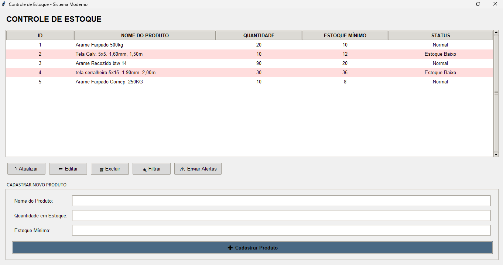
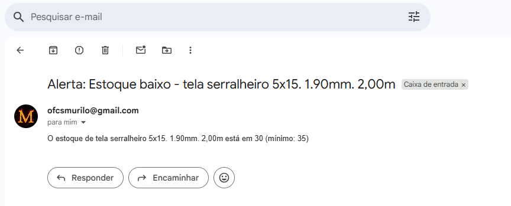

# Sistema de Controle de Estoque em Python

Sistema desktop simples para controle de estoque local com finaldade de demonstração de um MVP de controle de estoque em python, desenvolvido em Python com interface gráfica Tkinter, banco de dados SQLite e alertas de estoque mínimo via e-mail.

## 📸 Imagens do Sistema

**Tela Principal:**



**Alerta por E-mail:**



## 🚀 Como Executar

1. Certifique-se de ter o Python 3.10 ou superior instalado.
2. Instale as dependências:

```bash
pip install peewee
Clone ou baixe este repositório.

Execute o arquivo principal:

Execute com:

python main.py

O sistema abrirá uma janela com a interface gráfica.

🔧 Principais Funcionalidades
Cadastro de produtos com nome, quantidade e quantidade mínima.

Consulta, edição e exclusão de produtos.

Exibição de produtos em tabela com colunas:

ID

Nome

Quantidade atual

Quantidade mínima

Status visual de estoque

Sistema de cores:

Vermelho: estoque abaixo do mínimo

Amarelo: estoque no limite mínimo

Branco: estoque normal

Envio automático de alerta por e-mail quando o estoque atinge ou fica abaixo do mínimo.

📚 Bibliotecas Utilizadas
Tkinter — Interface gráfica nativa do Python.

Peewee — ORM para SQLite.

smtplib e email — Envio de e-mails pelo Python.

📌 Observação
Este sistema foi testado e validado apenas em ambiente local, sem suporte para múltiplos usuários ou ambientes em rede. Destina-se a apresentação de um trabalho da faculdade.
```
